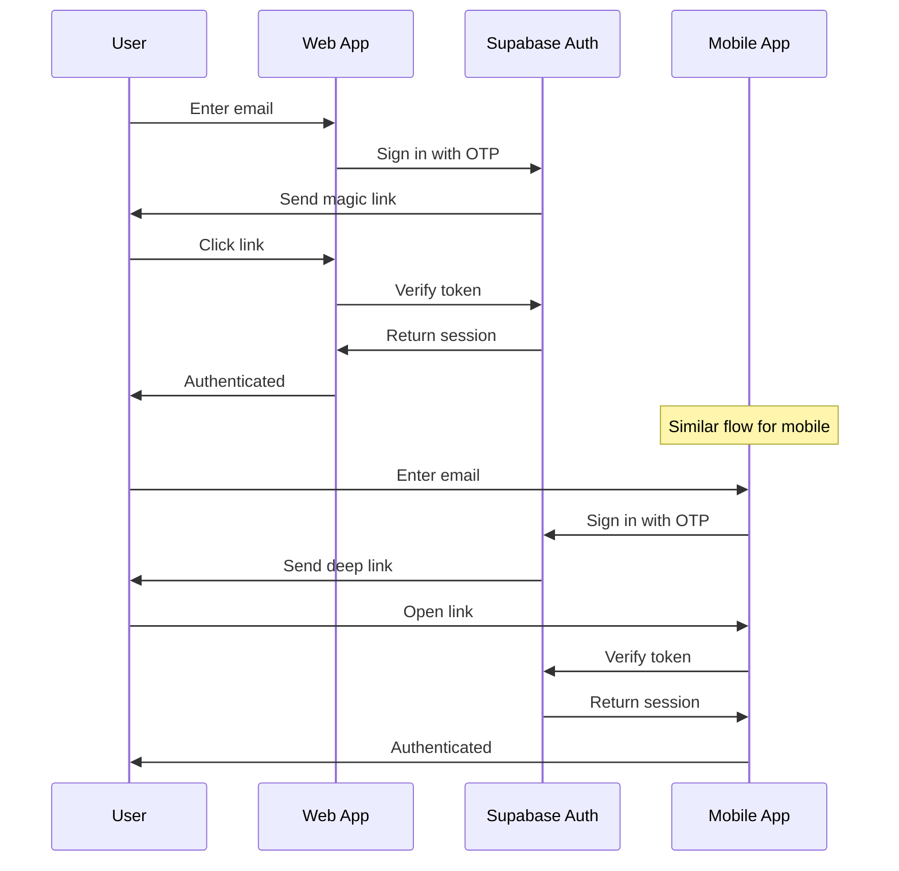
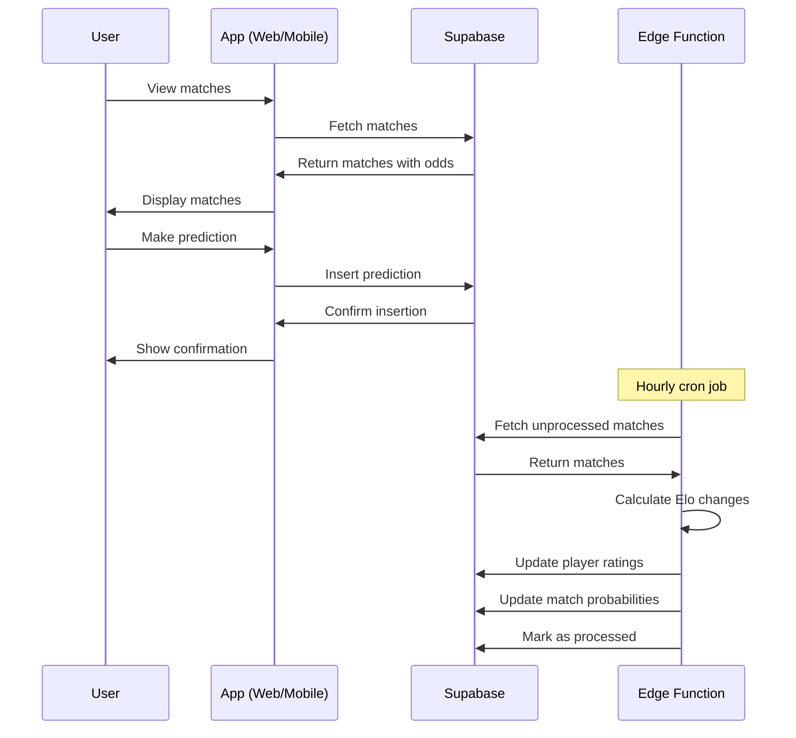
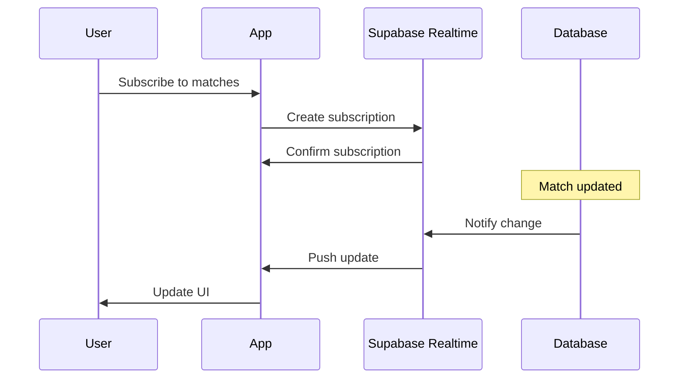

# Architecture Overview

## System Architecture

NetProphet is built as a modern, scalable platform with a clear separation of concerns:

```
┌─────────────────┐    ┌─────────────────┐    ┌─────────────────┐
│   Web App       │    │  Mobile App     │    │   Supabase      │
│   (Next.js)     │    │   (Expo)        │    │   Backend       │
└─────────────────┘    └─────────────────┘    └─────────────────┘
         │                       │                       │
         └───────────────────────┼───────────────────────┘
                                 │
                    ┌─────────────────┐
                    │  Shared         │
                    │  Packages       │
                    │  (UI + Lib)     │
                    └─────────────────┘
```

## Data Flow

### 1. Authentication Flow



### 2. Match Prediction Flow



### 3. Real-time Updates



## Database Design

### Core Tables

#### players
- **id**: UUID (Primary Key)
- **name**: TEXT (Player name)
- **club_id**: UUID (Foreign Key to clubs)
- **elo**: NUMERIC (Elo rating, default 1500)
- **created_at**: TIMESTAMP

#### matches
- **id**: UUID (Primary Key)
- **player_a**: UUID (Foreign Key to players)
- **player_b**: UUID (Foreign Key to players)
- **a_score**: INTEGER (Player A score)
- **b_score**: INTEGER (Player B score)
- **played_at**: TIMESTAMP (Match time)
- **prob_a**: NUMERIC (Probability player A wins)
- **prob_b**: NUMERIC (Probability player B wins)
- **points_fav**: INTEGER (Points for favorite)
- **points_dog**: INTEGER (Points for underdog)
- **processed**: BOOLEAN (Elo calculation status)

#### predictions
- **id**: UUID (Primary Key)
- **match_id**: UUID (Foreign Key to matches)
- **user_id**: UUID (Foreign Key to auth.users)
- **pick**: VARCHAR(8) ('player_a' or 'player_b')
- **stake_points**: INTEGER (Points wagered)
- **submitted_at**: TIMESTAMP

### Row Level Security (RLS)

The database implements RLS policies for security:

1. **Read Access**: All authenticated users can read clubs, players, and matches
2. **Predictions**: Users can only read/write their own predictions
3. **Time Restrictions**: Predictions can only be made until 5 minutes before match time

## Elo Rating System

The platform uses the Elo rating system to calculate player skill levels and match probabilities:

### Formula
```
Expected Score = 1 / (1 + 10^((Opponent Rating - Player Rating) / 400))
Rating Change = K * (Actual Score - Expected Score)
```

### Implementation
- **K Factor**: 32 (standard for amateur players)
- **Update Frequency**: Every hour via Edge Function
- **Minimum Rating**: 100 (prevents negative ratings)

### Points System
- **Favorite**: 10-60 points (based on win probability)
- **Underdog**: 40-90 points (higher risk, higher reward)

## Edge Functions

### update_elo
- **Trigger**: Scheduled (every hour)
- **Purpose**: Process completed matches and update ratings
- **Process**:
  1. Fetch unprocessed matches with scores
  2. Calculate Elo changes for both players
  3. Update player ratings
  4. Calculate new match probabilities
  5. Assign points based on odds
  6. Mark matches as processed

## State Management

### TanStack Query
- **Purpose**: Server state management and caching
- **Configuration**: 1-minute stale time, no refetch on focus
- **Use Cases**: Matches, predictions, leaderboard data

### Zustand
- **Purpose**: Client state management
- **Use Cases**: Authentication state, UI state, form data

## Real-time Features

### Supabase Realtime
- **Subscriptions**: Matches table for live updates
- **Triggers**: Database changes automatically push to clients
- **Use Cases**: Live match scores, new predictions, leaderboard updates

## Security Considerations

1. **Authentication**: Supabase Auth with magic links
2. **Authorization**: Row Level Security policies
3. **Data Validation**: Zod schemas on client and server
4. **Rate Limiting**: Supabase built-in rate limiting
5. **CORS**: Configured for web and mobile apps

## Performance Optimizations

1. **Database Indexes**: On frequently queried columns
2. **Query Optimization**: Efficient joins and filters
3. **Caching**: TanStack Query for client-side caching
4. **CDN**: Vercel Edge Network for web app
5. **Bundle Optimization**: Turborepo for build caching

## Monitoring and Observability

1. **Error Tracking**: Supabase error logs
2. **Performance**: Vercel Analytics
3. **User Analytics**: Supabase Analytics
4. **Database Monitoring**: Supabase Dashboard 